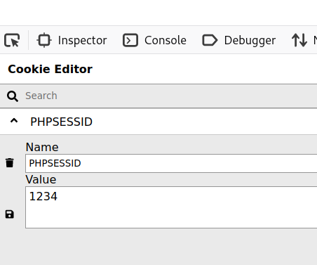

# CyberTalents - Web Security

## Challenge Name:
 [*The Restricted Sessions*](https://cybertalents.com/challenges/web/the-restricted-sessions)
 
## Challenge Description
Flag is restricted to logged users only , can you be one of them.

## Solution

For the first look, the website is somehow empty just a hint which tells you that you need to be logged in to get the flag, so let's investigate deeper.

Opening inspect to see the Html source code must be the first thing light in your mind, which will lead you to javascript code that makes a post request to a specific endpoint with the *PHPSESSID* cookie value when the browser cookies aren't empty.


> Note: `document.cookie.match(/PHPSESSID=([^;]+)/)[1]` extract the PHPSESSID value from the browser cookies

From the above discovery, we know that setting a value for the *PHPSESSID* cookie will fire a logic behind the scene, so we will add an arbitrary value for it using [**Cookie-Editor**](https://addons.mozilla.org/en-US/firefox/addon/cookie-editor/) extension or just modify the request using BurpSuite.



When refreshing the page a new output will appear telling you that "*Session not found in data/session_store.txt*" where we notice a path to sessions data, hitting on the link: "http://CHALLENGE_LINK/data/session_store.txt" will list sessions' ids that you can use to test the cookie instead of the arbitrary value.

Trying again to set the *PHPSESSID* cookie will show you that '*UserInfo Cookie doesn't have the username, Validation failed*' which means that we need to set another cookie "UserInfo" to bypass the validation, but how we will get the username for the current session id??

Do you Remember the js code from the first step? there was a post request to an endpoint called "**getcurrentuserinfo.php**" that takes the *PHPSESSID* as a parameter, I guess that the endpoint name point to the next step :)

Using *curl* you can easily hit the endpoint to get the required info
```
curl --form "PHPSESSID=[SESSION_ID_FROM_DATA_FILE]" http://[CHALLANGE_LINK]/getcurrentuserinfo.php

{
  "name": "USERNAME",
  "email": "EMAIL",
  "session_id": "SESSION_ID"
}
```

For the last step set the **UserInfo** cookie with the username you get from the endpoint. walaa you have bypassed the validation and now you are logged in successfully :)


### The Flag
 > sessionareawesomebutifitsecure 
