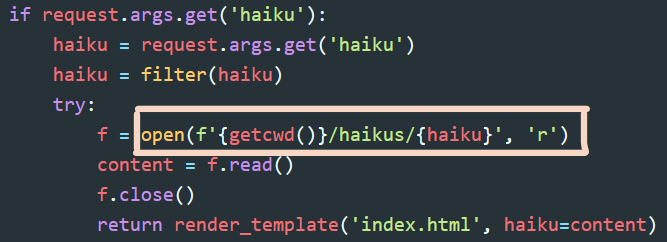

# CyberTalents - Secure Coding

## Challenge Name

 [*haiku_lover*](https://cybertalents.com/challenges/secure-coding/haiku_lover)

## Challenge Description

Can you fix this vulnerable code?

## Vulnerable code

```py
from flask import Flask, request, render_template
from os import getcwd
from utils import filter
app  = Flask(__name__, template_folder='templates')

@app.route('/', methods=['GET'])
def main():
 if request.args.get('haiku'):
  haiku = request.args.get('haiku')
  haiku = filter(haiku)
  try:
   f = open(f'{getcwd()}/haikus/{haiku}', 'r')
   content = f.read()
   f.close()
   return render_template('index.html', haiku=content)
  except Exception as e:
   print(str(e))
   return render_template('index.html', err=str(e))
 else:
  return render_template('index.html')
```

## Solution

To fix the vulnerable code we need to perform some code review techniques first, to find out the vulnerability then think about the mitigation process.

First try to find out if there is any user input that is used in file inclusion, os command execution, or database query creation, where you will notice that there is a GET parameter, "**haiku**", used to generate the file path of the page that will be rendered for the user.



> Note 1: **getcwd()** used to get the current work directory

As the user input used in the **open()** function so the code is vulnerable to LFI/Directory Traversal attack that allows an attacker to read arbitrary files on the server, which usually uses a set of this sequence "**../**" for exploitation.

We can sanitize the user input from this sequence  using various methods:

### Method 1: Use regex expression

```py
import re

def filter(dirty: str) -> str:
  regexp = re.compile(r"[.]{2}")
  clean = dirty.split(" ")[0]
    
  if regexp.search(clean):
    return "index"
  else:
    return clean
```

> Note 2: "*[.]{2}*" means that matches "." presented exactly 2 times in sequence eg. "../", "..../"
  
### Method 2: Use "in" condition

```py
def filter(dirty: str) -> str:
  if ".." in dirty:
    return "index"
  else:
    return dirty
```

### Method 3: Use "secure_filename" flask function

```py
from werkzeug.utils import secure_filename

def filter(dirty: str) -> str:
  return secure_filename(dirty)
```

> Note 3: Don't use "replace("../", "")" as malicious users can easily bypass it by providing this payload "..././" as an example, so ignoring/removing any double dots will be a better option.

Now, we have fixed this vulnerable code :)

### The Flag

 > FLAG{Con****************is}
