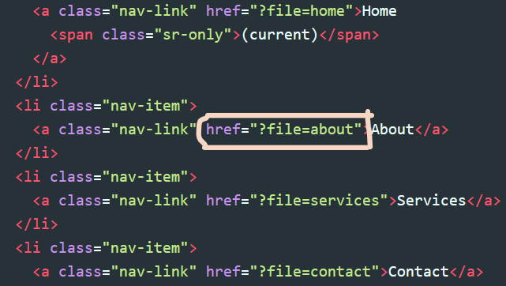
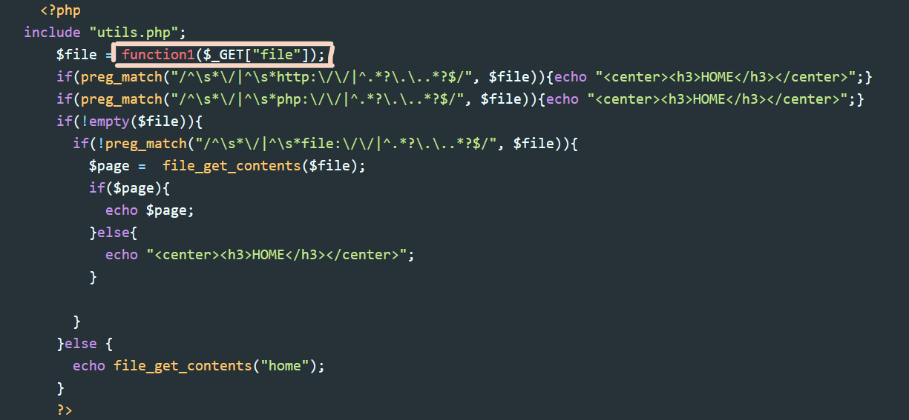

# CyberTalents - Secure Coding

## Challenge Name

 [*PHPbase*](https://cybertalents.com/challenges/secure-coding/phpbase)

## Challenge Description

Can you fix this vulnerable code?

Link: [http://3.122.227.44:5000/](http://3.122.227.44:5000/)

## Solution

To fix the vulnerable code we need to perform some code review techniques first, to find out the vulnerability then think about the mitigation process.

First try to find out if there is any user input that is used in file inclusion, os command execution, or database query creation, where you will notice that there is a navigator containing the blog pages' links each send a get request has "*file=PAGE_NAME*" parameter that considers as a shred of evidence tells us that there is a file inclusion logic executes for this page.




Moving a little bit down, we can find the php code for the file inclusion logic, the function that we will implement to correctly filter the user input, and also you can notice that the developer has already implemented some validation on the user input!




The developer used *preg_match* to validate that the malicious user will not be able to user wrapper, but he forgot about that this regex expression will only filter the lower case version of "http/php/file" wrappers :)

```php
preg_match("/^\s*\/|^\s*http:\/\/|^.*?\.\..*?$/", $file)
preg_match("/^\s*\/|^\s*php:\/\/|^.*?\.\..*?$/", $file)
!preg_match("/^\s*\/|^\s*file:\/\/|^.*?\.\..*?$/", $file)
```

Now, we know that the code is vulnerable to **LFI/RFI** so let's start implementing a secure filter to mitigate the risks. And as we here know exactly that there are only 4 pages allowed for file inclusion, the best solution is to compare the user input to a list of allowed file names

> Note 1: the allowed pages are: ["home", "about", "services", "contact"] (you can get them from the HTML nav-link tags)

```php
<?php
    function function1($data) {
        $allowed_pages = ['home', 'about', 'services', 'contact'];

        if (in_array($data, $allowed_pages, true)) {
            return $data;
        }
        return 'home';
    }
```

> Note 2: the third argument of *in_array* enables the strict comparison (===), so always stick on enabling this feature to prevent the type juggling risks.

Now, we have a secure user input filter that will fix this vulnerable code :)

### The Flag

 > FLAG{PHP*******************som3times}
